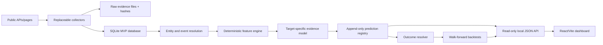

# Put It On The Wall — MVP product and technical blueprint

Decision date: 13 August 2026  
Status: implementation contract  
Constraint: no paid services or public deployment without owner approval

## A. Product definition

### User

The initial user is an analyst, operator, adviser or investor researching UK operating companies and needing evidence of operational change before it is fully reflected in reported results. The MVP is single-user research software; team workflows and client-facing permissions come later.

### Problem

Operational evidence is scattered across vacancies, filings, announcements, contracts and company pages. Conventional financial analysis sees many effects after they are quantified. News summaries do not preserve point-in-time evidence or prove whether their inferences were predictive.

### Product

PIOTW is an auditable longitudinal evidence and prediction system. It collects a deliberately small group of public sources, converts facts into reproducible events and features, registers immutable event forecasts, resolves later outcomes and measures whether the forecasts beat naive baselines.

### Core hypothesis

Publicly observable operational signals can predict defined commercially important events with useful lead time and incremental accuracy over financial/base-rate comparators.

### Value proposition

PIOTW shows:

1. what changed;
2. the dated public evidence proving it;
3. the specific event whose probability changed;
4. evidence for and against the forecast;
5. whether similar forecasts subsequently worked.

### MVP success criteria

The software succeeds when one historical company can travel through the complete immutable chain:

```text
source → evidence → canonical entity → event → feature snapshot
→ event forecast → registered prediction → resolved outcome → backtest metric → API/dashboard
```

The research hypothesis succeeds only if a larger frozen temporal test later shows useful lift, calibration and lead time versus declared baselines. Software completion does not imply predictive success.

## B. MVP scope

### Build now

- 120 UK-listed operating companies in signal-rich industrial sectors;
- four primary source families plus ONS sector controls;
- five objectively resolvable event targets;
- evidence/event/entity/feature separation;
- immutable prediction registry;
- Pressure and Expansion as simultaneous analytical dimensions;
- deterministic prior model and simple statistical-model interface;
- historical cutoffs, outcomes and backtests;
- read-only local API and static dashboard;
- fixture-based tests and a zero-cost local run mode.

### Build later

- weekly production orchestration on GitHub Actions after publishing approval;
- full 120-company collection and manual identity QA;
- PostgreSQL/object-storage deployment;
- regularised logistic and survival models once sample size supports them;
- planning portals, Find a Tender enrichment and regulator-specific adapters;
- reviewed LLM extraction assistance;
- user accounts, teams, alerts and exports;
- cross-company indices.

### Do not build

- one generic good/bad company score;
- share-price predictions;
- LinkedIn/Glassdoor scraping or access-control evasion;
- expensive historical jobs/news licences before demonstrated value;
- autonomous LLM scoring;
- microservices, queues or Kubernetes;
- public recommendations or claims of predictive superiority.

## C. Ranked event prediction taxonomy

| Rank | Target | Objective outcome definition | Horizon | Provisional base rate | Why it belongs in MVP |
|---:|---|---|---:|---:|---|
| 1 | `material_capacity_expansion` | First post-cutoff announcement/filing of capacity investment ≥2% of latest annual revenue, or explicitly material new facility/line/geography programme not already announced | 18m | 15% | Strong non-financial signals; objectively resolvable; commercially useful |
| 2 | `restructuring_announced` | First explicit material restructuring, site closure/consolidation, redundancy programme or group cost programme after cutoff; routine continuous improvement excluded | 12m | 12% | High-value pressure event with multiple leading signal families |
| 3 | `profit_trading_warning` | Company explicitly states expected profit/results are materially below its prior guidance or market expectation | 6m | 8% | Clear timestamp and high value; challenging low base rate |
| 4 | `operating_margin_deterioration` | Adjusted operating margin falls ≥150 basis points year-on-year in the first comparable result whose period ends after cutoff | 12m | 20% | Numeric and reproducible; strong financial baseline comparator |
| 5 | `senior_operational_leadership_change` | Previously unannounced appointment/departure of COO, divisional operations head, supply-chain/quality leader, CIO/CDO or transformation executive | 12m | 15% | Observable and may lead or accompany intervention/expansion |

Base rates are explicit priors for engineering and must be replaced by development-cohort estimates without using the temporal holdout. Acquisition/divestment, workforce changes and contract wins/losses remain labelled outcomes but are not primary v1 targets because materiality and denominator definitions are harder to make consistent.

## D. Evidence taxonomy

The ten top-level families are workforce, operational disclosure, leadership, capacity, procurement, product/quality, corporate actions, web/narrative, sector/macro and financial state. The machine-readable catalogue defines 54 features and half-lives.

The layers are non-interchangeable:

| Layer | Example |
|---|---|
| Evidence | 18 procurement vacancies observed on 10 May |
| Event | Company recruitment demand changed at its UK manufacturing operations |
| Feature | Procurement vacancies = 2.4× trailing median |
| Interpretation | Could reflect supplier intervention or expansion |
| Prediction | 61% probability of material capacity expansion within 18 months |
| Outcome | A qualifying £40m plant expansion announced eight months later |

## E. Smallest credible source set

### 1. Regulated/company disclosures

- **Role:** targets, outcomes, operational narrative and financial baseline.
- **Access/cost:** public documents; £0.
- **History:** generally strong.
- **Reliability:** high for what was disclosed; management narrative is not independent proof.
- **Effort:** medium PDF/HTML parsing plus manual validation.
- **Decision:** mandatory.

### 2. Company careers pages and documented ATS feeds

- **Role:** labour demand, function mix, site/geography and capability change.
- **Access/cost:** public GET feeds/page data where allowed; £0.
- **History:** weak, so begin point-in-time snapshots immediately.
- **Reliability:** medium; stale/evergreen adverts and outsourcing are confounders.
- **Effort:** medium because ATSs differ.
- **Decision:** mandatory non-financial leading source.

### 3. Companies House

- **Role:** canonical identity, officers, filings, charges and legal-structure events.
- **Access/cost:** free key; no usage fee planned.
- **History:** strong.
- **Reliability:** high for filed facts.
- **Effort:** low/medium.
- **Decision:** mandatory identity and leadership/corporate source.

### 4. Contracts Finder

- **Role:** public awards, value, suppliers and procurement activity.
- **Access/cost:** public read endpoints; £0.
- **History:** moderate and coverage-limited.
- **Reliability:** high for recorded awards; absence is meaningless for private demand.
- **Effort:** medium due to entity/subsidiary matching.
- **Decision:** include because it is structurally independent of company narrative.

ONS is a fifth supporting source used only to control for sector-wide conditions. Planning data is deferred because UK portal fragmentation creates disproportionate identity and collection work.

## F. Technical architecture and decisions



Concrete choices:

| Concern | MVP choice | Reason | Scale-later replacement |
|---|---|---|---|
| Language | Python 3.11+ | Data, modelling and collectors in one ecosystem | Keep |
| Frontend | React + Vite static app | Already working; cheap GitHub Pages path | Keep |
| API | Small read-only Python HTTP service | No new runtime dependency; enough for one user | FastAPI when deployed |
| Database | SQLite with migrations and immutable triggers | Zero administration; transactional and testable | PostgreSQL |
| Raw storage | Versioned local files by company/source/date/hash | Cheapest provenance-preserving option | S3-compatible object storage |
| Scheduling | Manual/configured scripts | No silent external operation | GitHub Actions after approval |
| Scraping | Documented APIs, urllib/robots-aware pages | Low dependency and fail-closed policy | Playwright only for permitted JS pages |
| Queue | None | Batch volumes do not justify it | Database-backed jobs before a broker |
| Analytics | Python stdlib + DuckDB/Polars later | No need to deploy a warehouse now | DuckDB first |
| ML | Deterministic weighted model | Explainable at tiny sample | Regularised logistic/survival models |
| LLM | Disabled | Not needed for first vertical slice | Reviewed structured extraction only |
| Authentication | Localhost only | Single-user MVP | GitHub/OIDC when deployed |
| Monitoring | Collector-run/error tables + command exit status | Sufficient and auditable | Hosted error/uptime service later |

## G. Database model

The operational SQLite schema and PostgreSQL migration implement:

- `companies` and `company_aliases` — canonical entities and exact/normalised aliases;
- `sources` and `collector_runs` — source policy and execution history;
- `evidence` — immutable factual observations and hashes;
- `events` and `event_evidence` — deduplicated underlying events with many evidence records;
- `feature_snapshots` — reproducible values at a declared cutoff and feature version;
- `model_versions` — immutable model/configuration identity;
- `predictions` and `prediction_evidence` — append-only forecast plus frozen features/evidence hash;
- `outcomes` — separately resolved post-cutoff events;
- `backtest_runs` and `backtest_results` — evaluation configuration and metrics;
- `peer_groups`/memberships — versioned comparison populations.

Prediction rows cannot be updated or deleted. Corrections create a new superseding prediction/model version; they never rewrite history. Important indexes cover company/time, source record uniqueness, content hashes, target/horizon/cutoff and unresolved outcomes.

## H. Historical simulation

1. Freeze cohort, target definitions, entity map, feature version, model version and prediction cutoffs.
2. Select evidence only where `available_at <= information_cutoff`.
3. Reconstruct source coverage as known at that cutoff; do not use today’s page state as historical evidence.
4. Resolve aliases/events using a resolver version valid for the run.
5. Calculate features solely from eligible evidence and vintage sector data.
6. Register predictions with a hash of ordered evidence IDs and feature values.
7. Lock prediction rows against updates/deletes.
8. Resolve outcomes from documents first available after cutoff and before horizon end.
9. Compare against development-set base rate, sector rate, company historical rate and declared financial rules.
10. Report Brier, calibration, precision/recall, average precision/PR-AUC, ROC-AUC when both classes are adequate, lift, lead time and errors.
11. Keep the final temporal holdout untouched until all model choices are frozen.

## I. Incremental delivery plan

1. **Vertical slice:** one Vesuvius disclosure → evidence/events/features → immutable capacity-expansion prediction → verified later outcome → stored Brier result → API/dashboard.
2. **Source breadth:** Companies House, ATS snapshots and Contracts Finder fixtures/live configured collectors.
3. **Target breadth:** all five target definitions and resolution rules.
4. **Cohort development:** 30-company development cohort, multiple historical cutoffs and coverage audit.
5. **MVP test:** expand to 120 companies, freeze model and run untouched later holdout.
6. **Go/no-go:** proceed only if non-financial/combined models improve useful metrics and lead time.

Every milestone ends with fixtures, stored outputs and executable validation—not a presentation alone.

## J. Cost estimate

| Item | Current MVP | Optional early deployment | Approval boundary |
|---|---:|---:|---|
| Development/runtime | £0 using existing machine/open-source tools | £0 | No purchase needed |
| Frontend hosting | £0 local | £0 GitHub Pages if repository/publication authorised | Publishing approval required |
| Database | £0 SQLite | £0 free tier or roughly £10–£25/month when persistence requires it | Spending approval required |
| Raw storage | £0 local | Usually pennies at MVP volume; budget ceiling £5/month | Spending approval required |
| Public APIs | £0 | £0 for selected sources | Separate review before paid data |
| Scraping/proxies | £0 | £0; do not use proxy services in MVP | Paid proxy prohibited without approval |
| AI | £0, disabled | £0 until extraction experiment approved | Explicit model/spend approval required |
| Monitoring | £0 command/database logs | £0 free tier initially | Paid service approval required |

Expected one-off cash cost to complete and operate the local MVP: **£0**. Expected authorised early-hosting range: **£0–£30/month**, but the recommended decision is to remain at £0 until the historical test justifies deployment.

## Initial universe decision

Start with **120 UK-listed companies**, not 300 and not large private companies. Use four adjacent strata—industrial manufacturing/materials, aerospace/engineering, logistics/construction and industrial technology—with 30 companies each.

Listed companies are preferred because disclosure dates, financial outcomes and identifiers are easier to verify. Multiple related sectors provide enough outcome variation to test sector normalisation without introducing consumer/financial-company business models whose signals have different meanings. The existing 30-name purposive frame becomes the development seed; it must be expanded and frozen without looking at post-cutoff outcomes.
