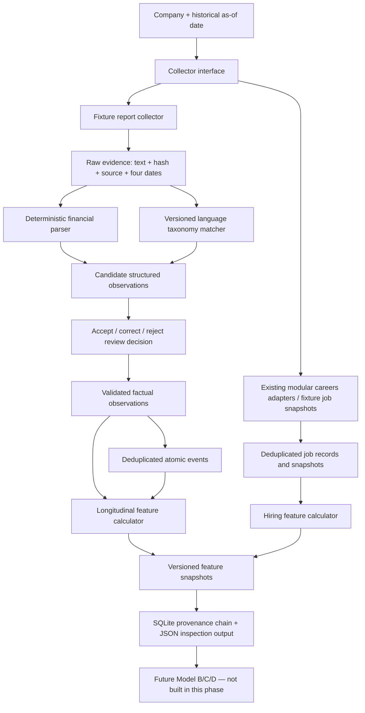

# Evidence Engine 0.1 — implemented architecture

## Boundary

Evidence Engine 0.1 is a parallel namespace. It does not import outcomes, calculate a Pressure/Expansion score, train a model, or modify Rules 1.0.0. `config/evidence/frozen_rules_1_0_0_guard.json` fingerprints 12 protected model, manifest, feature, evidence, prediction, comparator, lock, and implementation files before and after every demo.



## What each implemented stage does

| Stage | Input | Action | Output | Status |
|---|---|---|---|---|
| Frozen guard | Protected repository paths and committed SHA-256 values | Hashes and compares every protected artefact | Pass or fail before/after demo | Implemented |
| Collector contract | Company and historical `as_of_date` | Returns normalized `RawEvidence` records | Common evidence objects | Implemented abstract interface |
| Local report collector | Already-acquired PDF, HTML, or text annual/interim/accounts/results material | Applies publication cutoff, hashes source bytes, and extracts page-marked PDF text | Common raw evidence records | Implemented; quality-measured corpus remains synthetic |
| Report fixture collector | Twenty synthetic gold reports | Applies publication cutoff and builds hashes/metadata | Two periods for each of ten companies | Implemented for repeatable quality testing |
| Careers collection | Existing public ATS/structured-page adapters; v0.1 fixture snapshots | Normalizes postings to company/posting/title/function/location/time/status | Job records | Adapter infrastructure exists; demo is offline fixture-based |
| Raw preservation | `RawEvidence` | Writes exact text and stores content hash/source/time metadata | Preserved raw file + database record | Implemented |
| Financial extraction | Report text | Deterministically parses labelled currency, percentage, and ratio values | Numeric candidate observations | Implemented for supported patterns |
| Language extraction | Report sentences + YAML taxonomy | Matches explicit versioned patterns and retains exact sentence | Atomic language observations | Implemented; rule matching, not semantic LLM extraction |
| Review | Candidate observation + decision | Accepts, corrects value/unit, or rejects | Validated observation + immutable decision row | Implemented |
| Event construction | Accepted language observations | Deduplicates exact normalized company/type/period/span and marks novelty/persistence | Atomic events with evidence links | Implemented |
| Feature calculation | Accepted observations/events available by cutoff | Compares latest comparable periods; refuses currency/unit mismatch and missing pairs | Numeric and language feature snapshots | Implemented |
| Jobs feature calculation | Two deduplicated vacancy snapshots | Counts openings, arrivals, closures, mix, shares, geography, and seniority change | Hiring feature snapshots | Implemented |
| Persistence | Evidence, observations, events, features, decisions | Writes namespace-specific SQLite tables and provenance joins | Rebuildable database | Implemented |

## Running it

```bash
make evidence-demo
```

The command creates:

- `data/derived/evidence_engine_v0_1/demo.sqlite3` (ignored rebuildable database);
- `data/derived/evidence_engine_v0_1/raw/` (preserved fixture evidence);
- `data/derived/evidence_engine_v0_1/demo_output.json` (portable inspection output).

It runs report ingestion, preservation, extraction, fixture review, events, longitudinal features, jobs snapshots, combined features, provenance output, and the frozen guard. It never reads outcomes.

## Actual code map

- Contracts: `evidence_engine_v0_1/models.py`
- Collectors: `evidence_engine_v0_1/collectors.py` and existing `pipelines/careers/`
- Financial parsing: `evidence_engine_v0_1/parsing.py`
- Taxonomy/events: `evidence_engine_v0_1/taxonomy.py`
- Review: `evidence_engine_v0_1/review.py`
- Longitudinal features: `evidence_engine_v0_1/features.py`
- Jobs features: `evidence_engine_v0_1/jobs.py`
- Storage: `evidence_engine_v0_1/storage.py`
- Quality measurement: `evidence_engine_v0_1/quality.py`
- Orchestration: `evidence_engine_v0_1/pipeline.py`
- Demo entry point: `scripts/run_evidence_demo.py`
