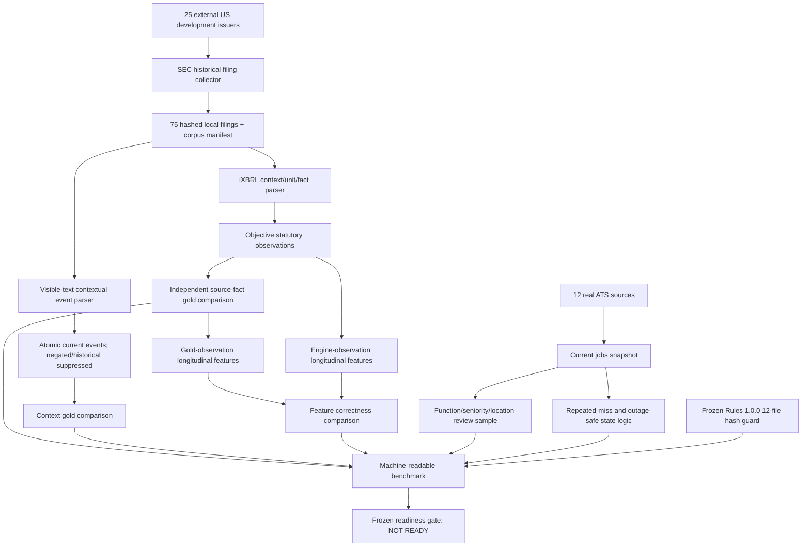

# Evidence Engine 0.2 — implemented real-world benchmark architecture

## Scope

Evidence Engine 0.2 is an extraction benchmark, not a prediction model. It reads no restructuring outcomes and produces no Pressure, Expansion, health, or probability score.



## Real-report ingestion

`scripts/build_evidence_v02_corpus.py` uses SEC primary-source submissions and filing archives with an identified low-rate user agent. The fixed universe is 25 US issuers that do not overlap the frozen UK restructuring manifests. It selects historical 2022–2024 filings and records URL, local path, SHA-256, publication/report dates, report type, difficulty flags, and explicit development-only status.

The raw SEC files are retained locally but git-ignored because the 75-file benchmark is approximately 280 MB. The manifest and hashes are versionable.

## Numerical extraction

`evidence_engine_v0_2/ixbrl.py` parses:

- consolidated, dimension-free contexts;
- start/end/instant periods;
- currencies and units;
- scale exponents;
- explicit and bracketed signs;
- statutory US-GAAP taxonomy identity;
- exact inline-XBRL source tags.

Company-defined adjusted facts are kept distinct from statutory US-GAAP facts. The parser excludes segment-dimensional and wrong-period facts and deduplicates exact equivalent facts.

Current supported real-filing metrics are revenue, operating profit, operating cash flow, capex, impairment charges, restructuring charges, inventory, and receivables. The benchmark does not yet validate EBITDA, margins, free cash flow, cash conversion, net debt/net cash, leverage, exceptional costs, redundancy costs, or site-closure costs on the real corpus.

## Event extraction

`evidence_engine_v0_2/events.py` retains exact visible filing sentences, maps them to atomic types, and suppresses matches identified as negated or historical/completed. It deliberately emits no composite score.

The benchmark includes 284 contextual cases in 15 difficult filings plus seven explicit ambiguity fixtures. Its important limitation is that gold discovery uses the same frozen event lexicon; it is therefore a regression/context benchmark, not an independently exhaustive semantic annotation.

## Longitudinal features

`gold_features.csv` freezes 141 expected changes calculated from independently selected annual-report source facts. The evaluator separately calculates the same changes from engine output and compares values. It never uses outcomes.

## Jobs reliability

The current trial uses Greenhouse, Lever, and Ashby. `evidence_engine_v0_2/jobs.py` requires:

- an explicitly successful collection;
- at least two consecutive healthy misses before closure;
- suppression of closures after an implausible site-wide drop;
- stable posting identity;
- repost linkage by normalized title/location;
- location normalization.

Because only one real snapshot exists, real closure accuracy and discovery recall remain unmeasured.

## Reproducible command

```bash
make validate-evidence-engine-real
```

The command validates partition boundaries and file hashes, ingests the local real corpus, extracts facts/events, calculates longitudinal comparisons, evaluates the stored jobs trial, writes JSON and Markdown reports, and reruns the frozen Rules guard.

Network collection is intentionally separate from validation so rerunning the benchmark does not silently change source data.

