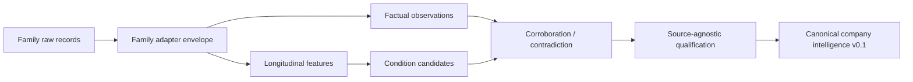

# PIOTW Multi-Source Evidence Depth v0.1

## Status and boundary

This is a development Detect-layer architecture, not scientific validation, a benchmark, a prediction or a score. It preserves raw evidence → factual observation → longitudinal feature → candidate → qualification → qualified condition.

`piotw_evidence/families_v01.py` defines a common envelope containing family ID, entity scope, cutoff, availability, source health, raw references, factual observations, family-specific features, candidates, corroboration metadata, missingness, provenance and a coverage row. Family payloads are not flattened into a misleading universal feature schema.

## Runtime

## Implemented families

### Careers / workforce — WORKING

- **Purpose:** observe published workforce demand and role mix.
- **Sources/raw shape:** approved Greenhouse, Lever and Ashby snapshots; posting ID, title, department, description, location, lifecycle, source hash and health.
- **Entity rules:** company/board identity plus explicit subsidiary or geography; ambiguity remains unknown.
- **Facts/features:** open roles, arrivals, persistence, confirmed closures, reopened roles, total trajectory, interval change, function/seniority/geography/technology mix.
- **Candidates:** hiring expansion/contraction and, when history supports it, functional-mix shift.
- **Corroboration:** leadership, estate and explicit workforce evidence; duplicate boards are not independent.
- **Missingness/cadence/provenance:** failure is not zero; legacy totals have no historical mix; collect every two days; retain board URL, job/source IDs, timestamps, hash, version and health.
- **Risks:** ATS incompleteness, reposts, outages, classification ambiguity and postings not equalling headcount.

### Estate / footprint / capacity — WORKING FOR DISCLOSED PERIOD SERIES

- **Purpose:** observe expansion, contraction or portfolio reshaping.
- **Sources/raw shape:** issuer network tables, primary location announcements, planning/site records; period counts, openings, closures, relocation/site identity and exact span.
- **Entity rules:** group, business unit and site remain distinct; site facts are not promoted to group level.
- **Facts/features:** site count trajectory, disclosed openings/closures, net movement and relocations.
- **Candidates:** estate expansion, contraction and reshaping. Capacity candidates require actual capacity evidence.
- **Corroboration:** planning, operations hiring, facility procurement or capex; copied announcements are derivative.
- **Missingness/cadence/provenance:** no complete register is assumed; issuer sources event-driven and site/planning sources weekly; retain dates, URL, span, hash, scope and version.
- **Risks:** disclosure bias, reclassification, stale location pages and relocation double-counting.

### Procurement / tenders — WORKING FOR APPROVED RESOLVED AWARDS; SHALLOW HISTORY

- **Purpose:** observe public award activity, disclosed value and category mix without calling awards growth.
- **Sources/raw shape:** Find a Tender OCDS releases and primary notices; notice/version, dates, buyer, supplier, value/currency, category, status, contract period, payload hash and resolution evidence.
- **Entity rules:** primary identifier or reviewed primary-notice legal-entity match required. Ambiguous suppliers are withheld.
- **Facts/features:** resolved awards, disclosed value by currency, award count by period, category mix and history depth.
- **Candidates:** activity acceleration/deceleration and category-concentration change only with comparable history.
- **Corroboration:** estate, technology, supply chain or issuer capex; release revisions are derivative.
- **Missingness/cadence/provenance:** public procurement is partial, not zero; collect daily; preserve notice ID/version, publication date, URL, hash and resolution method.
- **Risks:** supplier collisions, framework value versus spend, currency mismatch and public-sector bias.

### Leadership / organisation — WORKING FOR EXPLICIT ANNOUNCED CHANGES

- **Purpose:** observe appointments/exits, role changes and explicit operating-structure redesign.
- **Sources/raw shape:** primary company/regulatory announcements; role/change type, effective date, entity/function and exact span.
- **Entity rules:** group, subsidiary and business unit remain distinct; biographies, former employers and third parties are excluded.
- **Facts/features:** announced structure/role change, counts by type and affected functions.
- **Candidates:** organisational restructuring; leadership instability and capability build remain reserved until supported.
- **Corroboration:** workforce, estate, technology or explicit restructuring evidence.
- **Missingness/cadence/provenance:** private changes remain unknown; event-driven collection; retain publication/effective dates, URL, span, hash and scope.
- **Risks:** biography false positives, historical appointments and title changes without operational change.

## Design-complete deferred families

| Family | Safe observations/features | Entity rules and candidates | Corroboration and limits |
|---|---|---|---|
| Technology / transformation | Named platform/programme, milestone, rollout scope, implementation incident; novelty/persistence. | Group/function/site/vendor; technology investment, implementation or disruption. | Careers, procurement, issuer. Vendor claims are promotional and not independent impact evidence. |
| Supply chain / sourcing | Named supplier/material/region, certification share, logistics event; concentration/novelty. | Explicit supplier relationship; diversification, concentration or sourcing transition. | Procurement/regulatory/issuer; private spend is incomplete. |
| Customer / service / quality | Recall, service notice, disclosed metric, named customer case; frequency/persistence. | Product/customer/geography; service deterioration/recovery or quality intervention. | Regulatory/careers/issuer; testimonials and derivative press are biased. |
| Regulatory / planning | Application, decision, enforcement or recall with site/status/dates. | Legal entity/site; facility constraint, compliance intervention or planning-enabled change. | Estate/issuer; application is not approval or implementation. |
| Issuer / financial context | Revenue, margin, cash, debt, capex and explicit intervention with accounting basis. | Group/segment and statutory/adjusted identity; contextual candidates only under policy. | Corroborates other families but does not complete PIOTW; disclosure and definition drift remain. |

## Corroboration, contradiction and coverage

The graph is candidate → family claim → observation/evidence. Relationship types are independent support, same-source repetition, derivative duplicate and contradiction. Shared dimensions alone never create corroboration. Contradictory evidence remains visible and can block a directional candidate; a reshaping/transition candidate is valid only when mixed movement is its explicit factual mechanism.

Each run records a non-scoring coverage matrix: availability, health, history depth, latest evidence, entity-resolution quality, longitudinal readiness, qualification readiness and limitations.

## Real runs at 19 August 2026

| Company | Evidence | Qualification |
|---|---|---|
| Travis Perkins | 3 estate periods, 2 resolved public awards, 1 explicit structure announcement | Estate reshaping and organisational restructuring qualify under development policies. Procurement remains factual-only because history is shallow. Careers unavailable. |
| Cloudflare | 2 healthy careers snapshots | Hiring contraction remains `INSUFFICIENT_EVIDENCE`; estate, procurement and leadership are explicit `NO_HISTORY`. |

These runs do not validate the policies. Compare, Predict, Prescribe and Quantify remain unavailable or withheld. `scientific_gate_run=false` and protected outcomes/artefacts were not accessed.

## Next P0

Preregister a source-first review of the estate and leadership policies, exercise them on non-Travis evidence, and backfill primary-identifier procurement history. Detect should not move to Compare until that review shows the first real qualified conditions are not over-qualified.
# Multi-family review status

Real primary-source histories now exercise all four envelopes across seven development-safe companies. Estate has three to four comparable periods for four issuers. Leadership has direct evidence for three issuers, including two operating-structure candidates and one routine appointment retained as factual-only. Procurement has exact legal-identifier resolution for Mears Limited (`02519234`) and Kier Construction Limited (`02099533`), but only three comparable annual periods. Cloudflare careers remains two snapshots.

The shared envelope preserved source publication time separately from the operational effective/reporting period. Cutoff eligibility now uses information availability, preventing retrospective annual-report tables from entering an earlier historical run.

The v0.2 extension introduced `piotw-procurement-source-policy-find-a-tender-v0.1-development`: contract-award notices only, exact legal-identifier resolution, calendar publication periods and underlying-award deduplication. This makes the factual record reproducible but does not make notice-count changes a trustworthy operational condition. Procurement remains factual-only pending a coverage-aware policy study.
