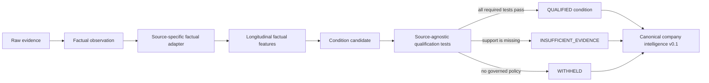

# PIOTW Operational Condition Qualification Engine v0.1

## Status and purpose

This is a development qualification gate between factual observations and customer-facing operational conditions. It is deliberately conservative, inspectable and non-predictive. The policy is versioned as `piotw-condition-qualification-policy-v0.1-development`; `scientifically_validated` is always false.

The engine asks whether PIOTW has earned the right to state an operational condition. It does not attempt to maximise condition volume.

## Architecture

The source adapters compute facts. The core qualification engine never reaches back into source-specific parsing and does not use company names or narrative generation.

## Three distinct objects

### Factual observation

A source-backed statement with an observation ID, evidence IDs, source records, time, entity scope, value/unit and collection health. Example: “The approved careers collector observed 297 open postings.”

### Condition candidate

A typed proposition to test, not a customer fact. Example: `hiring_contraction`. It contains the factual feature contexts required by the core: history, denominator, magnitude, persistence, corroboration, source health, entity scope and context availability.

### Qualified operational condition

A canonical operational condition is created only when every required development-policy test passes. Candidate wording never enters `conditions[]` when qualification fails. Failed candidates appear separately in `condition_qualifications[]` with `INSUFFICIENT_EVIDENCE` or `WITHHELD`.

## Versioned contracts

- Runtime models: `piotw_conditions/qualification_v01.py`
- Machine-readable schema: `config/piotw_operational_condition_qualification_v0_1.schema.json`
- Development policy: `config/conditions/qualification_policy_v0_1.json`
- Canonical read-model projection: optional `condition_qualifications[]` in `piotw-company-intelligence-v0.1`

A qualification result retains company/entity scope, cutoff, candidate family, observation/evidence lineage, dimensions, source families, history, denominator, magnitude, persistence, corroboration, quality, entity-scope validity, historical/peer context, materiality/mechanism status, direction/materiality where supportable, every test result, missing information and deterministic explanations.

## Controlled v0.1 candidate vocabulary

The vocabulary is intentionally small:

- hiring expansion;
- hiring contraction;
- workforce functional-mix shift;
- procurement activity acceleration;
- procurement category-concentration change.

Careers count movement and procurement activity are implemented. Functional-mix and category-concentration shapes are reserved in the contract but are not produced until longitudinal source data supports them.

## Qualification tests

| Test | What it prevents |
|---|---|
| Reference integrity | Candidates with missing observation or evidence lineage. |
| Duplicate evidence | Derivative or duplicated sources masquerading as corroboration. |
| Entity scope | Business-unit, subsidiary or third-party facts silently promoted to Group scope. |
| Source health | Failed/degraded collection treated as an operational state. |
| History depth | One isolated interval described as a trend. |
| Denominator | Absolute changes interpreted without scale. |
| Magnitude | Trivial movement promoted to materiality. |
| Persistence | One-off or reversing movements described as persistent. |
| Contradiction | Opposing observations collapsed into one directional condition. |
| Operational mechanism | Topics promoted without a traceable operational state. |
| Peer context | Explicitly records that the generic peer engine is unavailable; it is not required or invented in v0.1. |

Independent corroboration is recorded and strengthens confidence, but it is not a mandatory v0.1 test. The contract now distinguishes repeated evidence in one source, multiple observations within one family, multiple independent families, derivative duplicates and contradiction. Same-source observations never count as independent corroboration.

## Development policies

Thresholds are configuration, not hidden constants and not scientific truth.

For careers count expansion/contraction the current development policy requires:

- at least four healthy snapshots;
- at least three consistent directional intervals;
- an evidenced starting denominator;
- at least 10% absolute relative movement;
- consistent entity scope;
- no directional contradiction;
- a factual mechanism limited to published open-role inventory.

Even when those tests pass, materiality is labelled `LOW` and confidence remains `LOW` without independent corroboration. This prevents a development threshold from appearing stronger than its evidence.

For procurement activity acceleration the fixture policy requires four periods, two consistent intervals, an evidenced denominator, 25% relative movement, healthy collection and approved supplier/entity resolution. Runtime procurement remains unwired until supplier resolution is approved.

## Source adapters

### Careers

The adapter derives open-role state, absolute/relative change, denominator, snapshot count, observation period, intervals, movement consistency, source health and scope. Snapshot schema v0.1 now also preserves lifecycle counts, functional/seniority mix, geography/workplace mix and narrowly deterministic named-technology signals. Derived rows record `LIVE_COLLECTION`, `HISTORICAL_REPROCESSING` or `LEGACY_SUMMARY_ONLY` origin.

Only the 17 August raw run can be richly reprocessed. Earlier snapshots retain totals only, so the adapter emits missing-period flags and `None` rather than inventing historical mix. Rich fields remain factual features and cannot bypass qualification.

### Procurement

The second adapter groups approved, cutoff-safe resolved award records by publication month and can propose procurement activity acceleration. It proves the qualification core is not careers-specific. It is fixture-tested only because current unknown-company procurement records lack an approved supplier-to-company attachment.

## Customer explanation

The canonical object now carries deterministic candidate-assessment fields:

- what PIOTW observed;
- why the candidate might matter;
- passed/failed evidence tests;
- what remains unknown;
- what additional evidence would change the view.

The generic frontend renders failed candidates as assessments, not operational conditions. No generic LLM summary is used.

## Real multi-company run

| Company | Evidence | Candidate | Result | Main reason |
|---|---:|---|---|---|
| Cloudflare | 2 healthy careers snapshots, 305 → 297 | Hiring contraction | `INSUFFICIENT_EVIDENCE` | Only two snapshots; -2.62% below development magnitude; persistence unavailable. |
| Affirm | 2 healthy careers snapshots, 194 → 192 | Hiring contraction | `INSUFFICIENT_EVIDENCE` | Only two snapshots; -1.03% below magnitude; persistence unavailable. |
| Samsara | 2 healthy careers snapshots, 224 → 269 | Hiring expansion | `INSUFFICIENT_EVIDENCE` | Magnitude passes, but only two snapshots and no persistence. |
| Anduril | 2 failed attempts; no evidence | None | `INSUFFICIENT_EVIDENCE` at Detect | Failed collection is not converted to zero, stability or health. |

No real-company condition qualified. This is the expected and correct result for the present evidence depth.

The synthetic careers regression proves a persistent 100 → 85 → 70 → 55 series can qualify under the development policy. A fixture-backed procurement sequence proves the same source-agnostic core can qualify a non-careers candidate. These are code-path tests, not evidence that the policy is empirically valid.

## Failure behaviour and limitations

- Missing, future, failed or unhealthy evidence cannot become a condition.
- An unqualified result must keep direction and materiality `UNKNOWN`.
- A qualified result cannot contain failed required tests.
- Unknown evidence references fail qualification and canonical validation.
- Duplicate evidence fails qualification.
- No current company has enough careers history to test persistence.
- Careers postings do not equal hiring, headcount, workforce growth or distress.
- Procurement coverage is partial and unresolved company identity prevents runtime use.
- Peer context, validated materiality and independent corroboration remain absent.

## Future Compare and Predict integration

The result already carries historical- and peer-context statuses. A future benchmark engine can append governed peer/history evidence without redesigning the condition object. Predict must remain downstream of qualified conditions and a separately validated predictive-pattern engine; qualification itself produces no probability or forecast.

## Scientific boundary

This work is product/architecture development outside the protected Evidence Engine study. It does not access unseen validation documents, restructuring outcomes or holdout outcomes; alter Rules 1.0.0; run the frozen scientific gate; train Model 2; or introduce Pressure/Expansion.

## Multi-Source Evidence Depth v0.1 update

`piotw_evidence/families_v01.py` now formalises a common envelope around family-specific payloads. It preserves availability, health, cutoff, scope, raw references, observations, longitudinal features, candidates, corroboration/contradiction metadata, missingness and provenance. Careers, estate, procurement and leadership use this boundary in the real orchestrator.

The controlled vocabulary now also includes estate expansion/contraction/reshaping, procurement deceleration and organisational restructuring. Only estate reshaping and organisational restructuring have new development policies. Those policies do not alter the existing careers thresholds and remain subject to source-first review.

Travis Perkins supplies the first real multi-source runtime case: estate reshaping and an explicitly announced organisational restructuring qualify under development rules; two resolved public awards remain factual-only because history is too shallow. Cloudflare remains careers-only and its hiring candidate remains insufficient. Corroboration is relationship-based: sharing a dimension never makes another family independent support, and derivative duplicates or contradictions remain visible.
