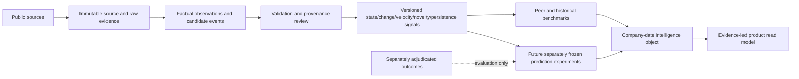

# PIOTW Operational Intelligence Architecture v1

> **CANDIDATE PRODUCT ONTOLOGY — NOT YET EMPIRICALLY VALIDATED**

## Product proposition

PIOTW should answer: **what changed inside this company, how unusual is it, and what source proves it?** The present Evidence Engine supplies part of that substrate. It does not yet supply a validated operational index or prediction model.



## Architectural layers

| Layer | Stable object | What enters | What comes out |
|---|---|---|---|
| Entity | company, business unit, site | identifiers and relationships | resolved scope and aliases |
| Source | source, source artefact, collection run | URL/document/snapshot | immutable captured material and timing |
| Evidence | evidence span | exact source fragment | addressable proof with page/section |
| Observation | observation | parsed factual statement/value | typed fact with period, unit, basis, scope and confidence |
| Event | candidate, context assessment, accepted/rejected event | textual evidence | explicit status, timing, entity and taxonomy mapping |
| Signal | feature definition and snapshot | verified observations/events | reproducible state, change, velocity, novelty or persistence |
| Benchmark | peer set and benchmark snapshot | comparable signals | percentile/deviation plus peer coverage |
| Prediction | experiment, model version, immutable prediction | cutoff-safe features | probability plus full lineage |
| Outcome | outcome definition and adjudication | post-horizon independent evidence | dated label for evaluation only |
| Product | company-date read model | evidence, signals, benchmarks, predictions | user-visible intelligence with provenance |

Stable identifiers link `company_id → source_id/source_artifact_id → evidence_id → observation_id/event_id → feature_snapshot_id → benchmark_snapshot_id/prediction_id`. Definitions and generated records have separate versions. A later outcome link references a prediction; it never mutates it.

Every source-family adapter exposes: source family, company/entity, fetch timestamp, published/effective timestamp, raw payload or artefact reference, content hash, retrieval status, next recommended collection time and source-specific metadata. Collection stops at raw evidence; extraction and interpretation are downstream stages.

## Company-date intelligence object

Every product view should be reproducible as of a timestamp and preserve unknowns:

```json
{
  "company_id": "company-stable-id",
  "as_of": "2026-08-17T12:00:00Z",
  "coverage": {"issuer_disclosures": "current", "careers_ats": "partial"},
  "observations": [],
  "events": [],
  "signals": [],
  "benchmarks": [],
  "predictions": [],
  "missing": [{"field": "net_debt", "reason": "not_reported"}],
  "provenance_complete": true
}
```

Null is not zero. Source failure is not an operational change. Every value must expose its information-available-at timestamp and evidence chain.

## Implementation sequence

1. Keep issuer-report extraction and event-context work as the factual core.
2. Make careers collection longitudinal and source-health aware.
3. Add public procurement awards/notices and regulatory operating notices using the common collector contract.
4. Build benchmark snapshots only after comparability rules and peer minimums are frozen.
5. Run future prediction experiments only after evidence validation, partitioning and outcomes are independently governed.

## Role of language models

An LLM may locate passages, propose structured candidates and adjudicate bounded context. It must return structured output linked to an exact source span, record model/prompt/version, and fail closed when uncertain. It must not invent facts, generate untraceable summaries, output operational scores, or directly assign prediction probabilities.

## Deliberately absent

This architecture contains no Pressure score, Expansion score, overall company-health score, predictive weights, outcome-derived feature selection, or Model 2. Those require later empirical decisions.
# Multi-Source Detect v0.1 update

The canonical Detect path now uses a common evidence-family envelope with family-specific payloads. Careers, estate, procurement and leadership adapters emit cutoff-safe factual observations, longitudinal features, controlled condition candidates, missingness and provenance into the source-agnostic qualification engine. Per-company evidence coverage is a matrix, not a score. Cross-family corroboration requires an explicit relationship and never arises merely because two facts share a PIOTW dimension. Deferred technology, supply-chain, customer/quality, regulatory/planning and issuer-context families have design-complete contracts but no shallow runtime collectors.
# Decision update — Multi-Family Condition Policy Review v0.1

The evidence-family envelope now distinguishes source publication time from the observation/effective period and retains legal-entity resolution metadata. Estate churn and net direction may be represented as separate candidates when both are directly supported. Procurement comparison history is counted by comparable period, not raw notice count.

The preregistered review did not meet its 12-decision minimum (11 observed), so Detect remains before Compare. The next architectural work is evidence-depth expansion within the same boundaries, especially source-specific procurement completeness and additional direct organisation-change cases.

## Decision update — Review Extension v0.2

The review now contains 14 decisions and leadership/organisation is development-usable. Procurement gained a versioned Find a Tender source boundary, but source coverage is not a valid activity denominator. One sparse notice-count increase qualified ambiguously, taking combined ambiguity to 21.43% against the frozen 20% maximum.

Detect is `NOT_READY_POLICY_INSTABILITY`. The next architectural P0 is a coverage-aware, source-specific procurement policy study. Compare remains unbuilt.
