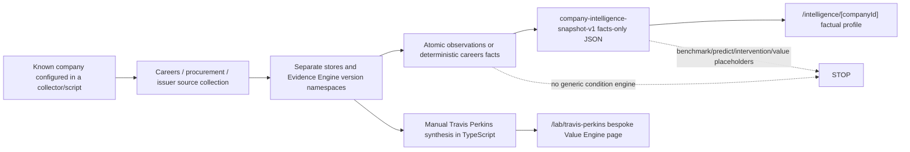
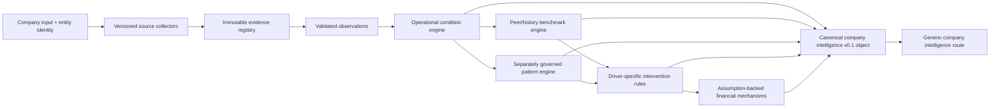

# PIOTW v0.1 gap audit

Status: repository audit and implementation record, 19 August 2026.

## Governing definition

PIOTW v0.1 is an outside-in operational-intelligence loop:

**Evidence → Operational Condition → Peer / Historical Anomaly → Predictive Pattern → Forecast / Hypothesis → Intervention → Financial Impact**

At product level: **Detect → Compare → Predict → Prescribe → Quantify**.

This definition supersedes older product framing that treated Rules 1.0.0, Pressure/Expansion or any isolated evidence experiment as PIOTW itself. Rules 1.0.0 remains a protected, narrow restructuring research asset.

## Repository audit by epic

| Epic | Status | What exists and genuinely works | Mocked, hard-coded or missing | Unknown-company blocker and risk |
|---|---|---|---|---|
| A. Company/source ingestion | **PARTIAL** | Modular careers collectors, lifecycle storage, source-health handling, common HTTP/page utilities, Find a Tender collector and issuer-report corpora. Files: `pipelines/careers/`, `pipelines/procurement/`, `pipelines/common/`, `evidence_engine_v0_1/collectors.py`. | No single arbitrary-company onboarding command; limited source adapters; procurement entity matches require review; report acquisition is corpus/script driven. | **P0.** An unknown company cannot yet be supplied and resolved across source families without engineering/manual setup. |
| B. Evidence structuring and provenance | **PARTIAL** | Raw evidence, observation/event models, source hashes, publication/availability dates, exact evidence pointers, reviewer workflows and anti-leakage tests exist across Evidence Engine 0.1–0.3.7. | Independent 0.3.7 human validation remains incomplete; multiple version namespaces are not unified behind one production service. | **P0 dependency.** Strong substrate, but product use must preserve the unresolved validation status. |
| C. Operational condition detection | **PARTIAL — DEVELOPMENT GATE IMPLEMENTED** | Atomic observations now feed source-specific careers/procurement feature adapters and a source-agnostic, versioned qualification core. History, denominator, magnitude, persistence, corroboration, entity scope, source health, contradiction and mechanism tests fail closed. The unknown-company object exposes qualified conditions separately from insufficient-evidence candidates. | The policy is development-only and not scientifically validated. No real company yet has enough careers history to qualify; procurement runtime attachment is unresolved; peer context is unavailable. Travis Perkins conditions remain analyst-authored. | **P0 validation/data-depth dependency.** The architectural boundary now generalises, but current evidence correctly produces no real qualified condition. |
| D. Peer and historical benchmarking | **PARTIAL** | Longitudinal careers history and a reproducible Travis Perkins estate comparison exist. Generic methodology is documented in `docs/piotw-benchmark-engine-v1-design.md`. | The TP cohort/data is a curated development artifact in TypeScript/JSON. No general cohort service, comparability registry or benchmark calculator is wired to arbitrary companies. | **P0.** Compare works for one bounded use case, not unknown-company operation. |
| E. Predictive pattern engine | **SCAFFOLDED** | Rules 1.0.0 is a frozen restructuring experiment; prediction protocols, immutable registries and anti-leakage machinery exist. | No validated operational pattern library or production prediction engine for the new product definition. Model 2 is not authorised/ready. | **P0.** Predict is honestly `NOT_BUILT`; it cannot be filled by narrative inference. |
| F. Intervention engine | **SCAFFOLDED** | Evidence-backed intervention hypotheses exist in the Travis Perkins lab; the new contract checks lineage, mechanisms and falsifiers. | No generic rules/evidence framework turns a condition and anomaly into a driver-specific intervention. Existing lab content is manually synthesised. | **P0.** Prescribe generalises only after condition/anomaly semantics and reusable intervention mechanisms exist. |
| G. Financial impact engine | **SCAFFOLDED** | The TP estate bridge exposes facts, assumptions, low/base/high range, incrementality and caveats. The new contract rejects ranges without assumptions/evidence. | No reusable driver-to-P&L/cash mechanism library. TP’s £28m/£42m/£57m range is gross cash continuation, not incremental EBITDA. | **P0.** Quantify is available for one transparent mechanism only; unsupported estimates must remain withheld. |
| H. Company intelligence experience | **PARTIAL** | Functional evidence watchlist/profile, briefs, North Star prototype and Real Company Lab exist in `piotw-web`. | Experiences use different types and data stores; Northstar is fictional, previous profile is facts-only, and the TP lab was a bespoke page. | The new `/intelligence/[companyId]/value` route and canonical contract remove the bespoke-page dependency, but arbitrary-company generation remains missing. |
| I. Validation and model governance | **PARTIAL** | Strong frozen-artifact guards, partitions, cutoff controls, evidence experiments, model cards and explicit scientific-state labels. | Evidence Engine 0.3.7 independent review is unfinished; operational comparison/intervention/value methods are development-stage; no product-level evaluation on unknown companies. | **P0 methodological constraint.** The product can demonstrate a connected contract without claiming scientific readiness. |

## Actual runtime before this task

Breaks and manual joins:

1. company onboarding is collector-specific;
2. evidence stores do not feed one canonical product assembler;
3. observation → material condition is manual/unvalidated;
4. the only real peer benchmark is a curated Travis Perkins artifact;
5. predictive-pattern outputs do not exist for operational intelligence;
6. intervention and value outputs are manually authored in a company-specific module;
7. the frontend has several incompatible contracts (`CompanyIntelligenceSnapshot`, fictional `NorthStarCompany`, and lab types).

## Smallest credible v0.1 target architecture

Every absent stage is represented as `WITHHELD`, `NOT_BUILT` or `INSUFFICIENT_EVIDENCE`; it is never completed with filler text.

## Critical path

### P0 — blocks the unknown-company release test

1. **Canonical end-to-end intelligence assembly and runtime contract.** Previously absent; materially implemented in this task.
2. **Unknown-company ingestion/orchestration.** Implemented for approved stored sources, with a cutoff-safe manifest and generic canonical output.
3. **Observation-to-operational-condition layer.** Development qualification architecture and rich careers snapshot contract implemented. One real rich snapshot per healthy company is preserved, but persistence and mix change remain untestable until legitimate future collections accumulate.
4. **General peer/history comparison engine.** Version cohort rules, comparability, denominators and suppression.
5. **Predictive pattern engine.** Define and validate what “tends to happen next” without leaking outcomes or borrowing Rules 1.0.0 claims.
6. **Reusable intervention and financial-mechanism libraries.** Require driver evidence, falsifiers and explicit assumptions.

### P1 — required for useful breadth/reliability

- broader source-family coverage and production source-health monitoring;
- entity resolution across subsidiaries, suppliers, sites and historical names;
- reusable activity/size/geography peer metadata;
- analyst review tooling for conditions, comparability and intervention evidence;
- snapshot registry and immutable company-date outputs.

### P2 — follows a credible loop

- portfolio aggregation and alerting;
- richer visual comparison;
- collaboration/permissions;
- commercial workflows and additional personas.

## P0 implemented in this task

The new canonical object is implemented in `piotw_intelligence/company_intelligence_v01.py` with a checked-in schema at `config/piotw_company_intelligence_v0_1.schema.json`. It represents company identity, cutoff, coverage, evidence, conditions, comparisons, predictions, interventions, financial impacts and exact stage readiness.

Validation fails closed when:

- a material object references unknown evidence;
- an unavailable comparison exposes a numerical result;
- a prediction lacks a model, horizon or conditions;
- an intervention lacks evidence or a driver mechanism;
- a financial range lacks evidence or explicit assumptions;
- a range is unordered;
- an unavailable prediction or impact leaks a number.

The generic loader and route are:

- `piotw-web/lib/data/company-intelligence-v01.ts`
- `piotw-web/app/intelligence/[companyId]/value/page.tsx`
- `piotw-web/components/company-value-intelligence.tsx`

The first source-backed object is `piotw-web/data/company-intelligence-v01/travis-perkins.json`. It proves one object can now feed Detect, Compare, Predict status, Prescribe, Quantify and evidence lineage. The runtime contains no company-specific answer branch. The dataset is a development demonstration, not an unknown-company success test.

## What now works

- One versioned object connects every product stage to a generic route.
- Missing capabilities are visible and machine-readable.
- Evidence IDs are validated across conditions, comparisons, interventions and value assumptions.
- A prediction cannot appear without a named model, horizon, probability and supporting conditions.
- A recommendation cannot appear without a driver and evidence.
- A financial range cannot appear without a mechanism, assumptions, evidence, incrementality and low/base/high ordering.
- The Travis Perkins intelligence can be viewed at `/intelligence/travis-perkins/value` without a hard-coded page implementation.

## What remains fake, manual or missing

- Travis Perkins condition selection, cohort selection, intervention and financial scenario are curated development analysis.
- No predictive result exists; `Predict` is `NOT_BUILT`.
- The financial range is historical gross cash-recycling capacity, not incremental EBITDA.
- Unknown-company collection, condition generation, cohort formation and financial linkage are not automated end to end.
- Evidence Engine scientific readiness remains unchanged.

## Latest P0 implementation: operational-condition qualification

`piotw_conditions/qualification_v01.py` now separates factual observations, typed condition candidates and qualified operational conditions. The policy is inspectable in `config/conditions/qualification_policy_v0_1.json`; the machine-readable result schema is `config/piotw_operational_condition_qualification_v0_1.schema.json`. The generic orchestrator projects qualification results into the canonical object and creates `conditions[]` only when required tests pass.

Cloudflare, Affirm and Samsara each produced a careers candidate that was correctly `INSUFFICIENT_EVIDENCE`; Anduril's failed collection produced no factual candidate. No real condition qualified. Synthetic persistent careers evidence and fixture-backed procurement evidence prove the source-agnostic core can qualify without introducing company-specific logic.

## Latest Detect depth sprint

The careers store now retains versioned per-snapshot role facts and aggregates. A deterministic backfill recovered 2,560 role rows from the one surviving raw run and marked 13 other rows `LEGACY_SUMMARY_ONLY`. No collector was due during the sprint, so history remains two totals and one rich snapshot per healthy company.

Qualification was rerun unchanged for Cloudflare, Affirm, Samsara, Anduril, Datadog and MongoDB. Five candidates were correctly `INSUFFICIENT_EVIDENCE`; Anduril produced none. No condition qualified, and source-first review found no reason to weaken policy.

The procurement pilot withheld all live candidates because supplier names lacked sufficient legal-entity evidence and repeated notices may be derivative. Cross-source corroboration remains unavailable.

## Next P0 task

Operate the approved cadence until at least four healthy snapshots—and at least two rich snapshots—exist for several companies, then preregister a careers persistence/mix review. In parallel, obtain a primary-identifier-backed procurement mapping and deduplicate notice versions. Do not build Compare until Detect has a source-first-supported real condition or a preregistered finding that policy is systematically over-conservative.

## Scientific boundary

`scientific_gate_run=false`. No restructuring, validation or holdout outcomes were accessed. Rules 1.0.0 and frozen Evidence Engine artifacts were not modified. Official Model 2 readiness remains **NOT READY**.

## Multi-Source Evidence Depth v0.1 update

Detect is no longer structurally careers-only. A common evidence-family envelope and reusable careers, estate, procurement and leadership adapters now feed the qualification engine and canonical company object. Travis Perkins exercises three real source-backed families; Cloudflare remains the non-Travis careers regression.

The development policies qualify Travis Perkins estate reshaping and its explicitly announced organisational restructuring. Procurement is held at factual-feature level because only two comparable periods exist. Cloudflare's two-snapshot hiring candidate remains insufficient. These outcomes are development diagnostics, not scientific validation.

The critical P0 is now source-first policy validation and non-Travis coverage. Before Compare, preregister a review of whether estate and leadership policies overstate materiality, add a primary-identifier procurement history, and exercise the same adapters on additional companies without curated answer logic.
# Multi-family policy review update (20 August 2026)

The preregistered Multi-Family Condition Policy Review v0.1 ran once over seven development-safe companies and four evidence families under the unchanged policy hash `b5af92d2c913a39e0bd756c0a5e17549fc5f02ec3eaa0c5af871b7f8fa26e97d`.

- 11 candidate decisions: 8 qualified, 3 insufficient evidence.
- Factual provenance and entity scope were complete for all 11 reviewed decisions.
- No severe reviewed false positive, false negative or unhandled contradiction was identified.
- No genuine cross-family corroboration was established; shared dimensions were correctly ignored.
- The preregistered minimum was 12 candidate decisions, so status is `NOT_READY_INSUFFICIENT_REVIEW_SCOPE`.

Detect remains the P0. The narrow gap is sufficient new leadership/organisation cases and deeper source-homogeneous procurement history, not another adapter abstraction. Compare remains unbuilt.

## v0.2 extension update (20 August 2026)

The extension added a direct abrdn operating-model/accountability redesign and same-regime Find a Tender histories for Mears Limited and Kier Construction Limited. Combined review scope is now 14 decisions. Leadership behaved correctly. Procurement produced one correct withhold and one ambiguous qualification.

The frozen ambiguity gate failed at 3/14 (21.43%) against a 20% maximum. Detect status is `NOT_READY_POLICY_INSTABILITY`. The remaining P0 is procurement condition-policy stability and source-coverage completeness; Compare remains unbuilt.
